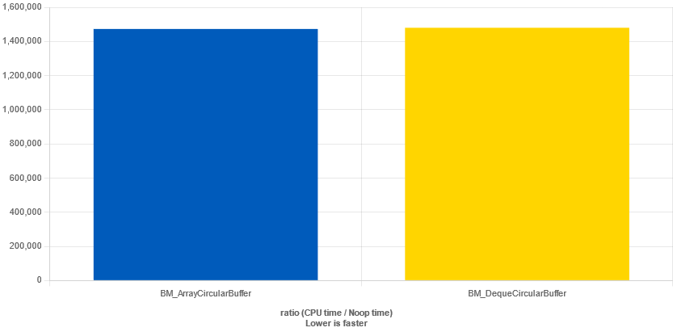

Your updated README file could look like this:

# Circular Buffer

A modern, fast, and efficient event logger implemented in C++20. This logger provides a way to log events with timestamps. It utilizes a circular buffer to store the latest `N` messages, ensuring a constant amount of memory usage.

## Features

- Fast logging with minimal overhead, optimized for speed with bitwise operations when buffer size is a power of 2.
- Utilizes C++20 concepts for type safety and code clarity.
- Provides an easy-to-read log output with timestamps.
- Customizable buffer size to fit specific use cases; static assertion ensures buffer size is a power of 2 for optimal performance.
- Circular buffer ensures fixed memory usage; oldest messages are discarded to make room for new messages.
- Extensible by using a custom event payload structure.
- Alternative implementation using `std::deque` provided for comparison.

## Implementation Discussion

The primary implementation employs a `std::array` to underpin the circular buffer, leveraging bitwise operations for index wrapping when the buffer size is a power of 2, theoretically promising a performance boost; however, this assertion didn't hold in practice.

An alternative implementation using a `std::deque` is also provided. During benchmarking, no significant performance difference was observed between the two implementations for a buffer size of 256.

Benchmarks are available on 



Benchmarks were done via https://quick-bench.com and below is the code provided:


```c++
static void BM_ArrayCircularBuffer(benchmark::State& state) {
  circular_buffer_array<signal, 256> logger;
  signal s{signal::transmission_type::SENT, signal::signal_type::SIGNAL1};
  for (auto _ : state) {
    logger.log(s);
    benchmark::DoNotOptimize(logger.to_string());  // Ensure the call is not optimized away
  }
}
BENCHMARK(BM_ArrayCircularBuffer);

static void BM_DequeCircularBuffer(benchmark::State& state) {
  circular_buffer_deque<signal, 256> logger;
  signal s{signal::transmission_type::SENT, signal::signal_type::SIGNAL1};
  for (auto _ : state) {
    logger.log(s);
    benchmark::DoNotOptimize(logger.to_string());  // Ensure the call is not optimized away
  }
}
BENCHMARK(BM_DequeCircularBuffer);
```

## Example Output

```lua
2023-10-17 14:18:10  SENT Signal 2.
2023-10-17 14:18:10  RECD Signal 3.
2023-10-17 14:18:10  SENT Signal 4.
2023-10-17 14:18:10  RECD Signal 5 This is a weird signal....
```
